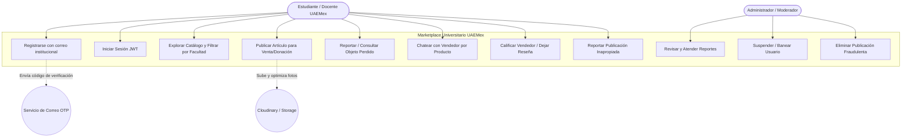
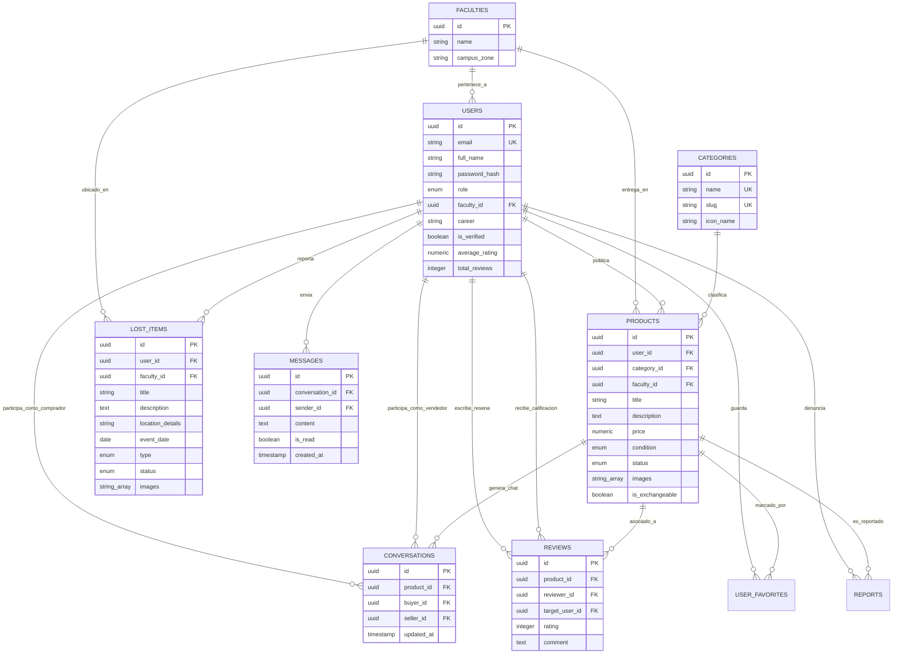
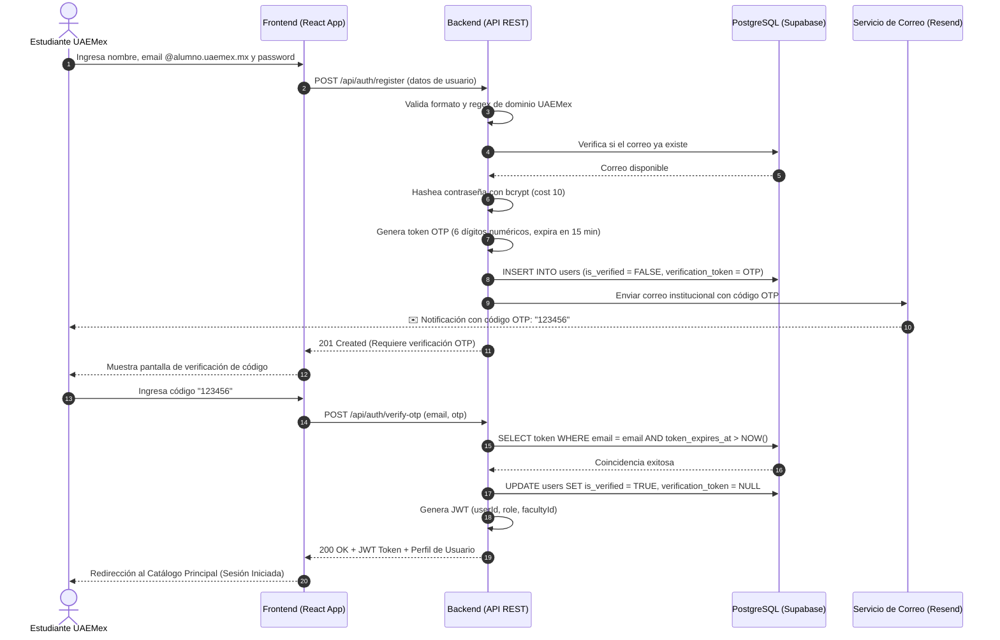
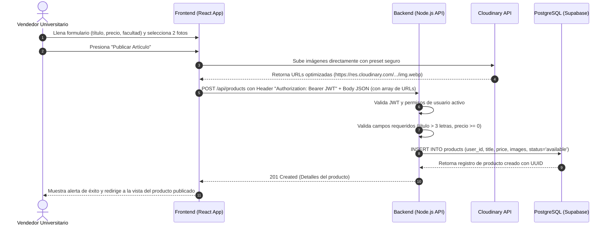
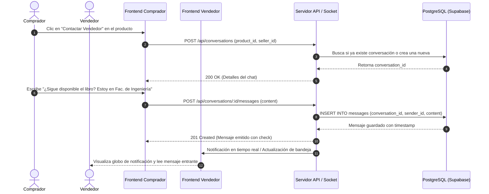

# 📐 DIAGRAMAS UML Y ARQUITECTURA TÉCNICA
### Proyecto: Marketplace Universitario UAEMex

---

## 1. 👥 DIAGRAMA DE CASOS DE USO GENERAL

---

## 2. 🗄️ DIAGRAMA ENTIDAD-RELACIÓN (MERMAID ERD)

---

## 3. 🔐 DIAGRAMA DE SECUENCIA: REGISTRO Y VALIDACIÓN OTP

---

## 4. 📦 DIAGRAMA DE SECUENCIA: PUBLICACIÓN DE PRODUCTO CON FOTOS

---

## 5. 💬 DIAGRAMA DE SECUENCIA: MENSAJERÍA / CHAT INTERNO

